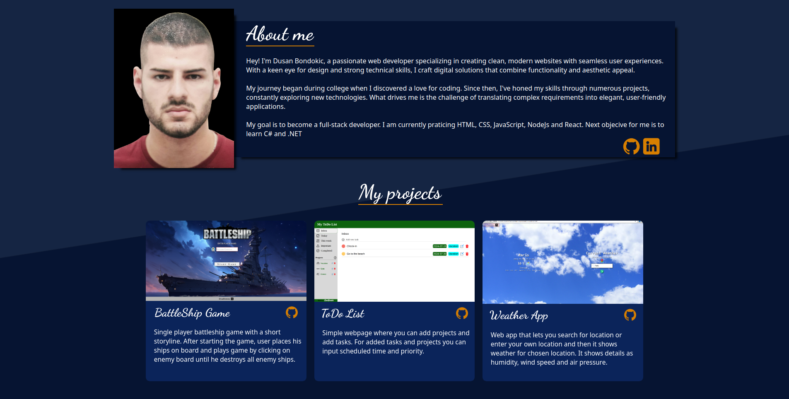

# My HomePage
Simple responsive homepage showing projects I built. Made it using Vanilla HTML, CSS and JS.

[LiveDemo](https://dulebondok.github.io/my-HomePage/)

## Features
- Responsive design intneded for mobile phones and tablets.
- Clickable icons

**🧭 Possible Future Implementations**
- Add more projects
- Add animations

## Resources
- <a href="https://www.flaticon.com/free-icons/mail" title="mail icons">Mail icons created by Freepik - Flaticon</a>
- Photo by Jason  Villanueva: https://www.pexels.com/photo/close-up-photography-of-cup-of-coffee-851555/

## 💻 Built With

